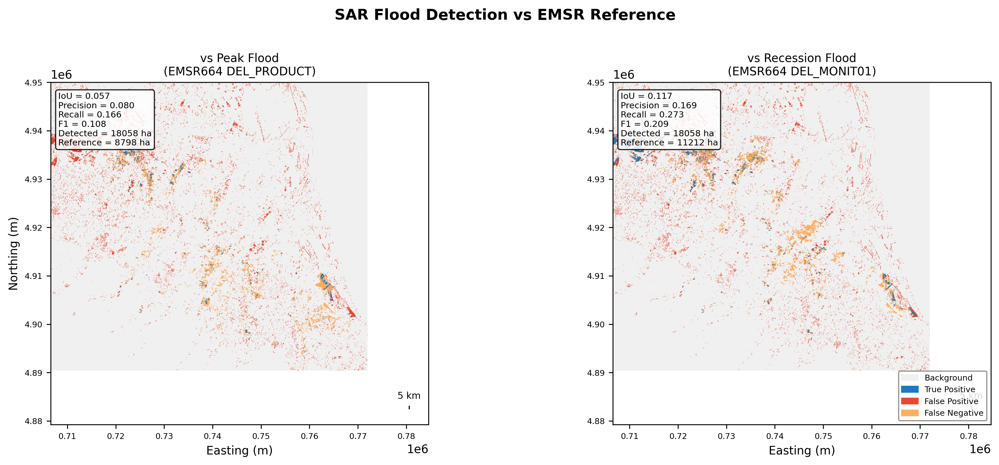
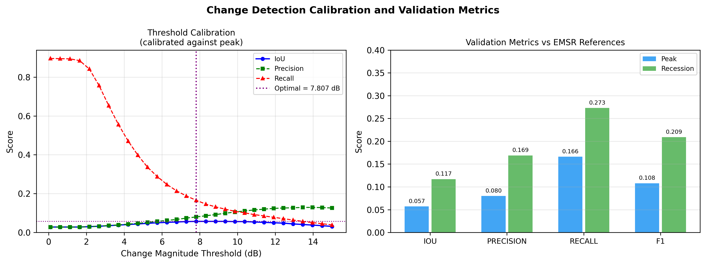

# SAR Flood Mapping — Emilia-Romagna, Italy (May 2023)

Sentinel-1 SAR change-detection flood mapping validated against Copernicus EMS (EMSR664) delineations. Part of [SARFloodAnalysis](../README.md).

---

## Data

| Role | Date | Scene |
|---|---|---|
| Pre-event | 10 May 2023 | `S1A_IW_GRDH_1SDV_20230510T051945` — Descending, Track 44 |
| Post-event | 22 May 2023 | `S1A_IW_GRDH_1SDV_20230522T051946` — Descending, Track 44 |

**Reference**: EMSR664 — peak flood (DEL_PRODUCT) and recession (DEL_MONIT01) delineations.

> The pre-event scene (10 May) was captured during early-stage flooding (event onset ~2 May). A true dry baseline would require a scene from April — this is the principal source of false positives.

---

## Pipeline

SNAP gamma-naught RTC (SRTM 1-sec DEM, UTM 32N, 20 m). Log-ratio change computed per polarisation:

```
ΔVV = post_VV − pre_VV   (dB)
ΔVH = post_VH − pre_VH   (dB)
Combined magnitude = √(ΔVV² + ΔVH²)
```

**Detection mode**: `combined_magnitude` — captures both open-water (VV decrease) and flooded-vegetation (VV increase) signals. Chosen over `directional_decrease` (IoU 0.047) and `pol_ratio` (IoU 0.032) for this mixed urban/agricultural scene.

**Masking**: JRC Global Surface Water ≥ 75% occurrence (permanent water excluded); SRTM slope > 5° (22% of scene excluded as steep terrain).

**Threshold calibration**: grid search 0.1–15 dB (30 steps), maximising IoU against the EMSR664 peak reference. Optimal: **7.807 dB**.

---

## Backscatter Comparison

<p align="center">

</p>

*Figure 1: VV gamma-naught before and after the flood.*

The pre/post visual difference is subtle — an early indicator that detection will be difficult. Three weeks of continuous rainfall had already saturated agricultural soils before the 22 May scene, compressing the apparent contrast between flooded and non-flooded areas.

---

## Change Map

<p align="center">

</p>

*Figure 2: VV log-ratio (ΔVV, dB). Blue = decrease, red = increase.*

The entire scene shows moderate backscatter decrease — not just the flood areas. Saturated agricultural soils produce a 0.5–3 dB VV decrease that is nearly indistinguishable from shallow flood water. Inside the EMSR664 reference the decrease is slightly stronger, but the mean separation is only **0.68 dB** — too small for clean thresholding.

```
Mean ΔVV inside  EMSR664 reference: −1.36 dB
Mean ΔVV outside EMSR664 reference: −0.68 dB
Signal separation:                    0.68 dB
```

---

## Flood Detection vs Reference

<p align="center">

</p>

*Figure 3: Classification vs EMSR664. Blue = True Positive, Red = False Positive, Orange = False Negative, Grey = correct background.*

False positives (red) spread across agricultural fields are wet soil misclassified as flood. True positives (blue) cluster along river channels. The recession reference yields higher IoU because persistent standing water is more specularly distinct from background soil moisture once the rainfall-driven saturation has drained.

---

## Results

| Reference | IoU | Precision | Recall | F1 | Detected | Reference area |
|---|---|---|---|---|---|---|
| Peak flood (DEL_PRODUCT) | 0.057 | 0.080 | 0.166 | 0.108 | 18,058 ha | 8,798 ha |
| **Recession (DEL_MONIT01)** | **0.117** | **0.169** | **0.273** | **0.209** | 18,058 ha | 11,212 ha |

---

## Threshold Calibration

<p align="center">

</p>

*Figure 4: IoU, precision, and recall vs threshold (left); final metrics at 7.807 dB (right).*

IoU peaks at 0.057 and the curve is broad and low across the full sweep — no threshold achieves clean separation. With only 0.68 dB signal separation, precision and recall cannot both be high simultaneously. The flat, low curve is diagnostic of overlapping pixel distributions rather than a tuning problem.

The higher recession IoU (0.117) confirms the hypothesis: persistent standing water after rainfall drains is more specularly distinct from background, making it easier to detect than the immediate flood peak.

---

## Running

```bash
cd emilia_romagna/
python scripts/run_processing.py   # SNAP RTC (~30-60 min per scene)
python scripts/run_analysis.py     # composites → change detection → validation
python scripts/make_figures.py
```

Configuration: [`config/pipeline_config.yaml`](config/pipeline_config.yaml)

---

## Data Sources

| Dataset | Source |
|---|---|
| Sentinel-1 IW GRD | [Copernicus CDSE](https://dataspace.copernicus.eu/) |
| EMSR664 delineations | [Copernicus EMS](https://emergency.copernicus.eu/mapping/list-of-activations-rapid/EMSR664) |
| SRTM 1-arc-second DEM | SNAP auxdata (NASA/USGS) |
| JRC Global Surface Water | [EC JRC](https://global-surface-water.appspot.com/) |

---

## References

- Twele, A. et al. (2016). Sentinel-1-based flood mapping: a fully automated processing chain. *Int. J. Remote Sens.* 37(13), 2990–3004.
- Chini, M. et al. (2017). Hierarchical Split-Based Approach for Parametric Thresholding of SAR Images. *IEEE TGRS* 55(12), 6975–6988.
- Pekel, J.F. et al. (2016). High-resolution mapping of global surface water and its long-term changes. *Nature* 540, 418–422.
- Farr, T.G. et al. (2007). The Shuttle Radar Topography Mission. *Rev. Geophys.* 45, RG2004.
