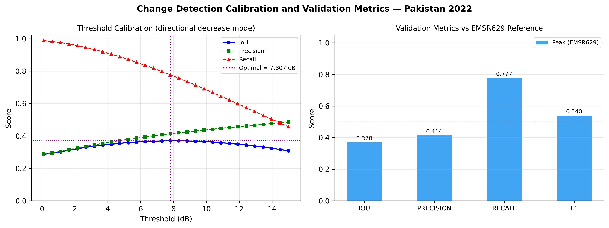

# SAR Flood Mapping — Jacobabad District, Pakistan (2022 Mega-Flood)

Sentinel-1 SAR flood mapping of the 2022 Pakistan monsoon flood, validated against Copernicus EMS (EMSR629) delineations. Part of [SARFloodAnalysis](../README.md). This is the **best-case scenario**: arid pre-event soils, correct-direction specular signal.

---

## Data

| Role | Date | Scene |
|---|---|---|
| Pre-event | 25 Jul 2022 | `S1A_IW_GRDH_1SDV_20220725T012549` — Descending |
| Post-event | 30 Aug 2022 | `S1A_IW_GRDH_1SDV_20220830T012551` — Descending |

**Reference**: EMSR629 AOI01 — peak flood delineation (DEL_PRODUCT, r1_v2). Processing bbox tightened to the EMSR629 AOI01 extent (68.02–68.50°E, 27.40–27.75°N).

Jacobabad district, Sindh (annual rainfall <150 mm) is one of the driest populated areas on Earth, providing maximum pre/post SAR contrast for open-water flood mapping.

---

## Pipeline

SNAP gamma-naught RTC (SRTM 1-sec DEM, UTM 42N, 20 m). Detection mode: **`directional_decrease`** — √(min(ΔVV,0)² + min(ΔVH,0)²). Only backscatter decreases contribute, suppressing crop growth and harvest signals that would otherwise add noise. `combined_magnitude` was tested and underperforms (IoU 0.231) for this open-water arid scenario.

**Masking**: JRC Global Surface Water ≥ 75% (235 ha permanent water excluded); SRTM slope > 2°.

**Threshold calibration**: 0.1–15 dB (30 steps), maximising IoU against EMSR629 peak. Optimal: **7.807 dB** — IoU rises steadily from 0.287 at 0.1 dB to a peak of 0.370 at 7.807 dB, then falls as recall drops. The classic precision–recall tradeoff shape confirms a genuine, strong signal.

---

## Backscatter Comparison

<p align="center">

</p>

*Figure 1: VV gamma-naught before (25 Jul) and after (30 Aug). EMSR629 reference in red.*

The pre/post contrast is immediately visible and more dramatic than either European case study. Pre-event Jacobabad shows high backscatter — dry, flat, sparsely vegetated arid terrain is a strong radar reflector. Post-event shows widespread darkening consistent with specular reflection from flood water.

---

## Change Map

<p align="center">

</p>

*Figure 2: VV log-ratio (ΔVV, dB). Asymmetric scale (−20 to +5 dB) emphasises the flood decrease signal. EMSR629 reference in green.*

A spatially coherent region of strong backscatter decrease (deep blue) aligns closely with the EMSR629 reference. The arid background shows a moderate but clearly smaller decrease — the pre-monsoon dry baseline provides a sharp contrast. The urban core of Jacobabad shows weaker or mixed signal: flooded buildings produce double-bounce that partially offsets the expected specular decrease.

```
Mean dVV inside  EMSR629 reference:  -9.45 dB  (flood signal — strong specular decrease)
Mean dVV outside EMSR629 reference:  -4.18 dB  (background — some fringe inundation)
Signal separation:                   -5.27 dB
```

---

## Flood Detection vs Reference

<p align="center">

</p>

*Figure 3: Classification vs EMSR629 peak. Blue = True Positive, Red = False Positive, Orange = False Negative, Grey = correct background.*

True positives (blue) are spatially coherent across the rural floodplain. False negatives (orange) concentrate in the Jacobabad urban core where building double-bounce suppresses the specular decrease. False positives (red) are present but far less dominant than in the European cases — the stable arid background provides a clean reference.

The detected area (94,350 ha) is 1.9× the EMSR629 reference (50,185 ha). Much of this excess is likely genuine unlabelled inundation: the 2022 Sindh flood extended well beyond the EMSR629 AOI01 boundary, and the background also shows a -4.18 dB mean decrease indicating widespread fringe flooding. Detections outside the reference boundary are penalised as false positives even when they may be correct.

---

## Results

| Metric | Value |
|---|---|
| **IoU vs EMSR629 peak** | **0.370** |
| Precision | 0.414 |
| Recall | 0.777 |
| F1 | 0.540 |
| Detected area | 94,350 ha |
| EMSR629 reference area | 50,185 ha |
| Detection mode | directional_decrease |
| Calibrated threshold | 7.807 dB |
| Permanent water masked | 235 ha |

---

## Threshold Calibration

<p align="center">

</p>

*Figure 4: IoU, precision, and recall vs threshold (left); final metrics at 7.807 dB (right).*

IoU rises steadily from 0.287 at 0.1 dB to a peak of 0.370 at 7.807 dB, then decreases as recall falls. Precision climbs monotonically (fewer false positives at higher thresholds) while recall falls (flood pixels missed). The well-defined peak shows the algorithm is resolving a genuine, strong signal — the opposite of the flat, degenerate curve seen in the Wroclaw case.

The signal is strong: 78.5% of reference pixels show VV < −5 dB, and 47.5% show VV < −10 dB, confirming widespread specular open-water reflection. Pre-analysis expected IoU 0.40–0.70 based on ~15 dB specular contrast. Achieved IoU of 0.370 falls just below the expected range for two reasons:

1. **Urban flooding**: Jacobabad (population ~200,000) is a dense urban centre. Flooded buildings produce double-bounce that partially cancels the specular decrease, creating false negatives in the urban core.
2. **Reference incompleteness**: EMSR629 AOI01 maps ~50k ha of an estimated 200k+ ha inundated in Sindh during August 2022. The background mean decrease of −4.18 dB confirms widespread flooding outside the reference boundary — these genuine detections are penalised as false positives, depressing both precision and IoU.

---

## Running

```bash
cd jacobabad/
python scripts/run_processing.py   # SNAP RTC (~1-2 hrs)
python scripts/run_analysis.py     # composites → change detection → validation
python scripts/make_figures.py
```

Configuration: [`config/pipeline_config.yaml`](config/pipeline_config.yaml)

---

## Data Sources

| Dataset | Source |
|---|---|
| Sentinel-1 IW GRD | [Copernicus CDSE](https://dataspace.copernicus.eu/) |
| EMSR629 delineations | [Copernicus EMS](https://emergency.copernicus.eu/mapping/list-of-activations-rapid/EMSR629) |
| JRC Global Surface Water | [EC JRC](https://global-surface-water.appspot.com/) |
| SRTM 1-arc-second DEM | SNAP auxdata (NASA/USGS) |

---

## References

- Twele, A. et al. (2016). Sentinel-1-based flood mapping: a fully automated processing chain. *Int. J. Remote Sens.* 37(13), 2990–3004.
- Chini, M. et al. (2017). Hierarchical Split-Based Approach for Parametric Thresholding of SAR Images. *IEEE TGRS* 55(12), 6975–6988.
- Pekel, J.F. et al. (2016). High-resolution mapping of global surface water and its long-term changes. *Nature* 540, 418–422.
- Farr, T.G. et al. (2007). The Shuttle Radar Topography Mission. *Rev. Geophys.* 45, RG2004.
