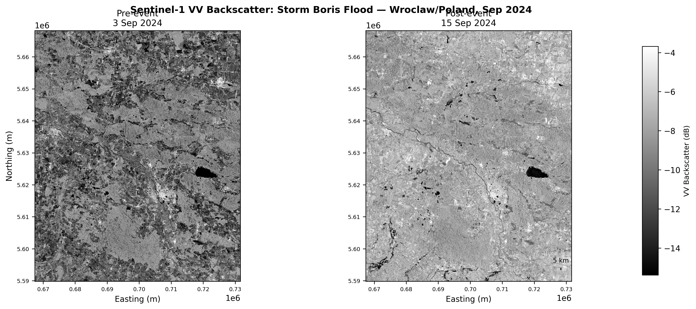
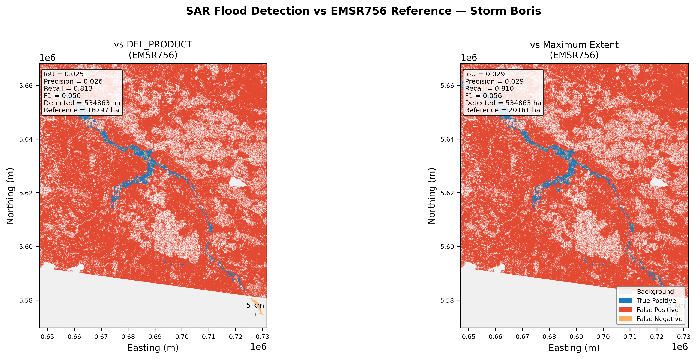
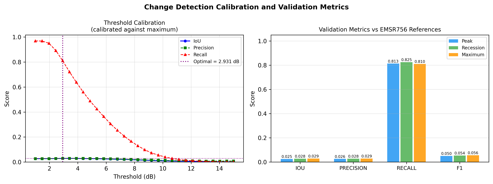

# SAR Flood Mapping — Wroclaw/Lower Silesia, Poland (Storm Boris, September 2024)

Sentinel-1 SAR flood mapping of the Storm Boris event, validated against Copernicus EMS (EMSR756) delineations. Part of [SARFloodAnalysis](../README.md). This case study is the **hardest-case scenario** — the dominant SAR mechanism is physically inverted relative to the pipeline's assumptions.

---

## Data

| Role | Date | Scene |
|---|---|---|
| Pre-event | 3 Sep 2024 | `S1A_IW_GRDH_1SDV_20240903T050123` — Descending |
| Post-event | 15 Sep 2024 | `S1A_IW_GRDH_1SDV_20240915T050124` — Descending |

**Reference**: EMSR756 — peak (DEL_PRODUCT), recession (DEL_MONIT01), and maximum flood extent. Calibration performed against maximum extent (most complete reference).

---

## Pipeline

SNAP gamma-naught RTC (SRTM 1-sec DEM, UTM 33N, 20 m). Detection mode: `combined_magnitude` — √(ΔVV² + ΔVH²). No slope filter applied (predominantly flat floodplain).

**Threshold calibration**: 1.0–15 dB (30 steps), maximising IoU against maximum extent reference. Optimal: **2.931 dB**.

---

## Backscatter Comparison

<p align="center">

</p>

*Figure 1: VV gamma-naught before (3 Sep) and after (15 Sep). EMSR756 peak reference in red.*

The pre/post change inside the reference area is subtle and in places shows a slight brightness increase rather than the expected darkening of flood water. This is the first visual indicator that the flood mechanism does not match the pipeline's open-water assumption.

---

## Change Map

<p align="center">

</p>

*Figure 2: VV log-ratio (ΔVV, dB). Blue = decrease, warm tones = increase. EMSR756 reference in green.*

Inside the flood reference (green), the landscape shows predominantly **positive** ΔVV — backscatter increased rather than decreased. This is the signature of **flooded-vegetation double-bounce**: flood water acts as a specular reflector beneath standing September crops, bouncing radar energy back into the canopy and returning more signal to the sensor than the pre-flood dry vegetation state.

Outside the reference, agricultural harvest and tillage across the region produces even larger positive changes, providing a noisy background that overwhelms any flood signal.

```
Mean ΔVV inside  EMSR756 reference:  +1.167 dB  (backscatter INCREASED — double-bounce)
Mean ΔVV outside EMSR756 reference:  +1.571 dB  (agricultural calendar dominates)
Signal separation:                     0.404 dB  (distributions statistically indistinguishable)
```

---

## Flood Detection vs Reference

<p align="center">

</p>

*Figure 3: Classification vs EMSR756. Blue = True Positive, Red = False Positive, Orange = False Negative, Grey = correct background.*

At the lowest practical threshold (2.93 dB), 534,863 ha is flagged as flood against a reference of 16,797–20,161 ha. The false-positive mass (red) covers the agricultural plain, driven by harvest/tillage signal. Missed flood (orange) concentrates in the Odra floodplain — exactly where double-bounce makes detection impossible with a magnitude-change metric.

---

## Results

| Reference | IoU | Precision | Recall | F1 | Detected | Reference area |
|---|---|---|---|---|---|---|
| Peak (DEL_PRODUCT) | 0.025 | 0.026 | 0.813 | 0.050 | 534,863 ha | 16,797 ha |
| Recession (DEL_MONIT01) | 0.028 | 0.028 | 0.825 | 0.054 | 534,863 ha | 19,214 ha |
| **Maximum extent** | **0.029** | **0.029** | **0.810** | **0.056** | 534,863 ha | 20,161 ha |

High recall (>80%) reflects indiscriminate scene-wide detection rather than genuine flood identification. Precision (~2.9%) is near the floor because detected area (534k ha) is 26× the reference extent.

---

## Threshold Calibration

<p align="center">

</p>

*Figure 4: IoU, precision, and recall vs threshold (left); final metrics at 2.931 dB (right).*

IoU is flat across the entire sweep, never exceeding 0.029. At low thresholds precision is near zero; at high thresholds recall collapses while precision barely recovers (the surviving pixels are agricultural hotspots, not flood). The flat curve is the definitive diagnostic: pixel distributions inside and outside the reference are statistically indistinguishable at every operating point — no threshold can separate them.

This is not a pipeline failure. Standard SAR change detection requires flood water to produce specular open-water reflection (VV strongly decreases). Flooded September vegetation produces the opposite. This event requires polarimetric coherence, quad-pol decomposition, or multi-temporal phenology modelling rather than single-date intensity change detection.

---

## Running

```bash
cd wroclaw/
python scripts/run_analysis.py     # composites → change detection → validation
python scripts/make_figures.py
```

Configuration: [`config/pipeline_config.yaml`](config/pipeline_config.yaml)

---

## Data Sources

| Dataset | Source |
|---|---|
| Sentinel-1 IW GRD | [Copernicus CDSE](https://dataspace.copernicus.eu/) |
| EMSR756 delineations | [Copernicus EMS](https://emergency.copernicus.eu/mapping/list-of-activations-rapid/EMSR756) |
| SRTM 1-arc-second DEM | SNAP auxdata |
| JRC Global Surface Water | [EC JRC](https://global-surface-water.appspot.com/) |

---

## References

- Twele, A. et al. (2016). Sentinel-1-based flood mapping: a fully automated processing chain. *Int. J. Remote Sens.* 37(13), 2990–3004.
- Chini, M. et al. (2017). Hierarchical Split-Based Approach for Parametric Thresholding of SAR Images. *IEEE TGRS* 55(12), 6975–6988.
- Pekel, J.F. et al. (2016). High-resolution mapping of global surface water and its long-term changes. *Nature* 540, 418–422.
- Farr, T.G. et al. (2007). The Shuttle Radar Topography Mission. *Rev. Geophys.* 45, RG2004.
